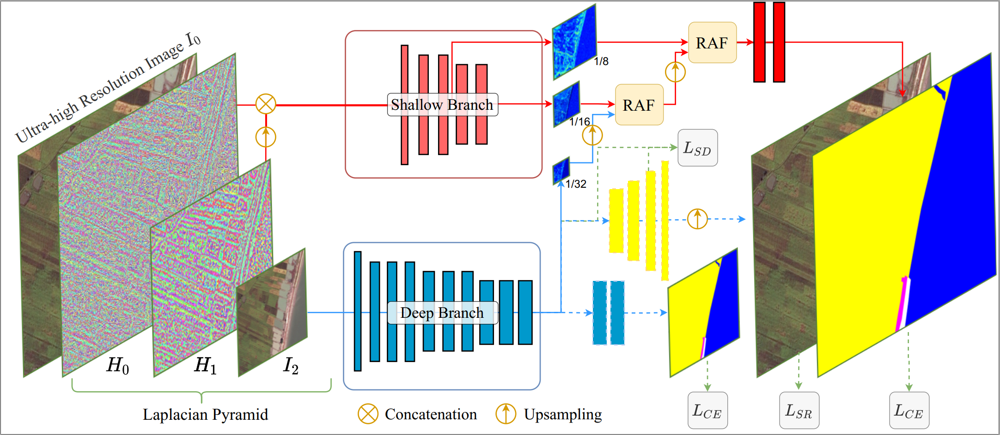

# ISDNet



This repository will provide the code for the following paper:

**ISDNet: Integrating Shallow and Deep Networks for Efficient Ultra-high Resolution Segmentation**<br>
Accepted to CVPR2022
Paper
> **Abstract:** *The huge burden of computation and memory are two obstacles in ultra-high resolution image segmentation. To tackle these issues, most of the previous works follow the global-local refinement pipeline, which pays more attention to the memory consumption but neglects the inference speed. In comparison to the pipeline that partitions the large image into small local regions, we focus on inferring the whole image directly. In this paper, we propose ISDNet, a novel ultra-high resolution segmentation framework that integrates the shallow and deep networks in a new manner, which significantly accelerates the inference speed while achieving accurate segmentation. To further exploit the relationship between the shallow and deep features, we propose a novel Relational-Aware feature Fusion module, which ensures high performance and robustness of our framework. Extensive experiments on Deepglobe, Inria Aerial, and Cityscapes datasets demonstrate our performance is consistently superior to state-of-the-arts. Specifically, it achieves 73.30 mIoU with a speed of 27.70 FPS on Deepglobe, which is more accurate and 172x faster than the recent competitor.*

# Code
Our code is based on MMSegmentaion (version 0.16.0).

## Installation
### Create a conda virtual environment and activate it (conda is optional)
```
conda create -n isdnet python=3.8 -y
conda activate isdnet
```
### Install dependencies
```
# Install pytorch firstly, the cudatoolkit version should be same in your system.
conda install pytorch==1.6.0 torchvision==0.7.0 cudatoolkit=10.1 -c pytorch

# Or you can install via pip
pip install torch==1.6.0 torchvision==0.7.0

# Install
python setup.py develop
```
## Datasets
We follow [FCtL](https://github.com/liqiokkk/FCtL) to split dataset.
### DeepGlobe
Please register and download [DeepGlobe](https://competitions.codalab.org/competitions/18468) dataset.
Create folder named 'root_path', its structure is  
```
    root_path/
    ├── img_dir
       ├── train
          ├── xxx_sat.jpg
          ├── ...
       ├── val
       ├── test
    ├── rgb2id
      ├── train
          ├── xxx_mask.png(0-6)
          ├── ...
      ├── val
      ├── test
```


### Inria Aerial
Please register and download [Inria Aerial](https://project.inria.fr/aerialimagelabeling/) dataset. 
Create folder named 'root_path', its structure is  
```
    root_path/
    ├── imgs
       ├── train
          ├── xxx_sat.tif
          ├── ...
       ├── test
       ├── val
    ├── labels
       ├── train
          ├── xxx_mask.png(two values:0-1)
          ├── ...
       ├── test
       ├── val
```

### Training
DeepGlobe
`./tools/dist_train.sh configs/isdnet/isdnet_1224x1224_80k_deepglobe.py 4`

Inria Aerial
`./tools/dist_train.sh configs/isdnet/isdnet_1224x1224_80k_deepglobe.py 4`

### Evaluation
Accuracy:
`python tools/test.py config_file checkpoints_file --eval mIoU`

*Please download following pretrianed-model [here](https://drive.google.com/file/d/1FfG-qRlGy-2BsVjN2ZcKTEG9wZeo3sdW/view?usp=sharing)*

FPS:
`python tools/fps_test.py config_file --height height of the test image --width width of the test image`


## Results
### DeepGLobe
| Class | urban | agriculture | rangeland |forest | water | barren | unknown |
| :---: | :---: | :---: | :---: | :---: | :---: | :---: | :---: |
 IoU | 79.55 |88.21 |42.48 | 79.82 | 84.58 | 65.20 | - |

### Inria Aerial
| Class |  building  | background |
| :---: | :---: | :---: |
| IoU | 74.39 | 97.58 |


## Citation
If you use this code and our results for your research, please cite our paper.
```
@inproceedings{guo2022isdnet,
  title={ISDNet: Integrating Shallow and Deep Networks for Efficient Ultra-High Resolution Segmentation},
  author={Guo, Shaohua and Liu, Liang and Gan, Zhenye and Wang, Yabiao and Zhang, Wuhao and Wang, Chengjie and Jiang, Guannan and Zhang, Wei and Yi, Ran and Ma, Lizhuang and others},
  booktitle={Proceedings of the IEEE/CVF Conference on Computer Vision and Pattern Recognition},
  pages={4361--4370},
  year={2022}
}